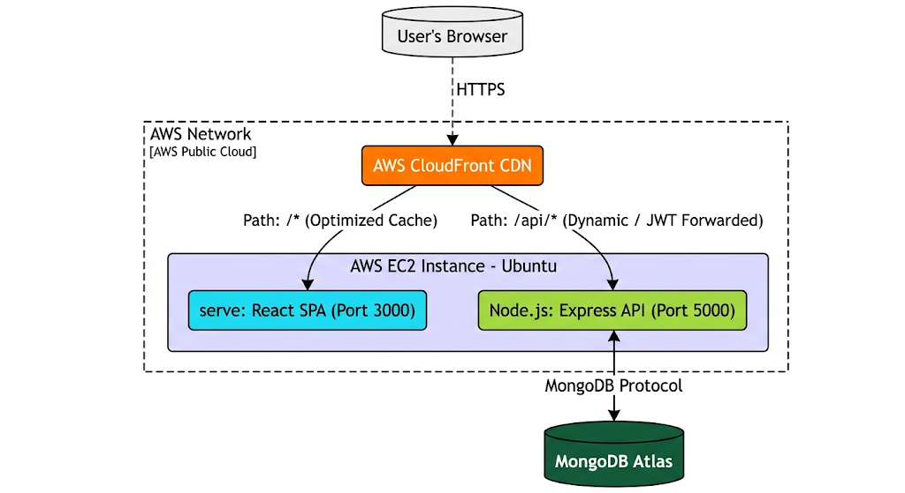

# Task Manager Application

## 1. Project Overview
Task Manager is a secure, full-stack web application designed to help users efficiently organize, track, and manage their daily tasks. Users can securely register, authenticate, and perform complete CRUD (Create, Read, Update, Delete) operations on their personal task lists. It is built to industry standards, featuring a fluid interface, strict backend validation, and a completely automated, zero-downtime deployment pipeline.

## 2. Architecture
The application utilizes a distributed, decoupled architecture:
*   **Client (Frontend)**: A Single Page Application (SPA) communicating over HTTPS to a RESTful API. Hosted statically initially, and optimized through a CDN.
*   **API (Backend)**: A stateless, Node.js REST API that handles business logic and security policies. It enforces authentication on protected routes.
*   **Database**: A NoSQL cloud database (MongoDB Atlas) storing User and Task collections.
*   **Edge/Proxy (CloudFront)**: Acts as a reverse proxy, SSL terminator, and caching layer, seamlessly routing requests between the client and the API over a unified domain while preserving critical authentication headers.

## 3. System Design Diagram



## 4. Tech Stack
*   **Frontend**: React.js, Vite build tool, Vanilla CSS (dynamic UI).
*   **Backend**: Node.js, Express.js.
*   **Database**: MongoDB Atlas, Mongoose (ODM).
*   **Authentication**: JSON Web Tokens (JWT) stored in HTTPOnly cookies, bcryptjs (password hashing).
*   **CI/CD**: GitHub Actions.
*   **Cloud Hosting**: AWS EC2 (Ubuntu), AWS CloudFront (CDN), PM2 (Process Manager).

## 5. Repository Structure
```text
Task-Manager-Application/
├── .github/
│   └── workflows/
│       ├── ci.yml         # Continuous Integration (Lint, Build, Test coverage)
│       ├── deploy.yml     # Continuous Deployment (SSH to EC2, PM2 auto-restart)
│       └── security.yml   # Scheduled OWASP dependency scanning
├── backend/
│   ├── config/            # DB connection setup
│   ├── controllers/       # Route request handlers and business logic
│   ├── middleware/        # Auth verification, error handling
│   ├── models/            # Mongoose schemas (User, Task)
│   ├── routes/            # Express router endpoints
│   ├── server.js          # Entry point and security configurations
│   └── package.json       
└── frontend/
    ├── public/            # Static assets (Favicon, etc.)
    ├── src/
    │   ├── api/           # Axios interceptors and direct API calls
    │   ├── components/    # Reusable React components
    │   ├── context/       # Global state management (Auth Context)
    │   ├── pages/         # High-level views (Dashboard, Login)
    │   ├── App.jsx        # Root component and router
    │   └── main.jsx       # React DOM injection
    ├── vite.config.js     # Bundler configuration
    └── package.json       
```

## 6. Security: OWASP Top 10 Implementations
The application strictly adheres to OWASP security principles. Below are direct examples from the codebase.

### A02: Cryptographic Failures & A07: Identification Failures (Secure Cookies)
Tokens are protected against Cross-Site Scripting (XSS) by using strict cookie configurations.
```javascript
// backend/controllers/authController.js
const options = {
  expires: new Date(Date.now() + 7 * 24 * 60 * 60 * 1000), // 7 days
  httpOnly: true, // Prevents XSS (JavaScript cannot access the cookie)
  secure: process.env.NODE_ENV === 'production', // Requires HTTPS in production
  sameSite: 'lax', // Protects against Cross-Site Request Forgery (CSRF)
  path: '/',
};
res.status(statusCode).cookie('token', token, options).json({ success: true, token });
```

### A03: Injection (ReDoS Protection)
Raw user input passed directly into Regex can cause a Denial of Service (ReDoS) attack. We sanitize meta-characters before querying.
```javascript
// backend/controllers/taskController.js
if (req.query.search) {
  // Escape regex metacharacters to prevent ReDoS attacks
  const escaped = req.query.search.replace(/[.*+?^${}()|[\]\\]/g, '\\$&');
  query.title = { $regex: escaped, $options: 'i' };
}
```

### A03: Injection (XSS Sanitization & Input Validation)
Validators ensure data integrity before controllers execute. User inputs (like `description`) are escaped to prevent stored XSS.
```javascript
// backend/routes/taskRoutes.js
const taskValidation = [
  body('title').notEmpty().trim().escape(),
  body('description').optional().trim().escape(), // Prevents Stored XSS
  body('priority').optional().isIn(['low', 'medium', 'high']),
  body('status').optional().isIn(['pending', 'in-progress', 'completed']),
  body('dueDate').optional().isISO8601()
];
```

### A09: Security Logging and Monitoring (Audit Trails)
Failed logins and Invalid tokens are explicitly tracked for intrusion detection.
```javascript
// backend/controllers/authController.js
try {
  const user = await User.findOne({ email }).select('+password');
  if (user && (await user.matchPassword(password))) {
    console.log(`[SECURITY] Login success | email=${email} | ip=${req.ip}`);
    sendTokenResponse(user, 200, res);
  } else {
    console.warn(`[SECURITY] Login failed | email=${email} | ip=${req.ip}`);
    res.status(401).json({ message: 'Invalid email or password' });
  }
}
```

## 7. CI/CD Pipeline Implementation
We utilize **GitHub Actions** to automate continuous integration and deployment. 

1. **Continuous Integration (`ci.yml`)**: On every push or pull request to the `main` branch, the CI runner spins up. It performs security audits (`npm audit`), enforces code formatting (`npm run lint`), and verifies that the frontend builds successfully (`npm run build`). This guarantees broken code is never marked "deployable."
2. **Continuous Deployment (`deploy.yml`)**: If the CI step passes, the deployment workflow triggers. It connects to the AWS EC2 instance over SSH (using injected GitHub Secrets for security). On the server, it pulls the latest code from the repository, runs a deterministic install (`npm ci`), re-compiles the React application, explicitly writes the necessary environment variables safely via Bash `echo` commands, and restarts PM2 without downtime (`--update-env`).

## 8. Cloud Hosting (AWS EC2 + CloudFront)
The architecture scales by dividing static delivery from dynamic computing.

*   **AWS EC2 (The Origin Server)**: An Ubuntu virtual machine runs Node.js. It manages two PM2 processes: the Express API (running on Port 5000) and `serve` (hosting the static React build on Port 3000).
*   **AWS CloudFront (The Global Proxy)**: The CDN distribution acts as the public-facing gateway for the users. 
    *   **Behavior 1 (`/*`)**: Routes to Port 3000 on the EC2 origin. CloudFront uses `CachingOptimized` to aggressively cache static React assets across global edge nodes, ensuring sub-second load times for the UI. It redirects 404s to `index.html` to support the SPA router.
    *   **Behavior 2 (`/api/*`)**: Routes to Port 5000 on the EC2 origin. Caching is **Disabled** entirely (dynamic data). Crucially, the Origin Request Policy is set to `AllViewerExceptHostHeader`, which enforces that incoming JWT Authentication cookies, CORS domains, and Authorization headers are perfectly forwarded from the client browser through CloudFront and securely into the Express API.


## 9. Local Development & Containerization (Docker)
The project is fully containerized for seamless, platform-agnostic local development and open-source distribution.

### Docker Configuration
1.  **Backend (`backend/Dockerfile`)**: Secures a minimal `node:24-alpine` image to install server dependencies deterministically and expose the Express API on port 5000.
2.  **Frontend (`frontend/Dockerfile`)**: Employs an ultra-efficient **Multi-stage Build**. It compiles the React application via Vite, instantly discards the heavy build tools, and strictly serves the static `dist` bundle via a lightweight micro-server on port 3000.
3.  **Network Coordination (`docker-compose.yml`)**: Links both microservices within an encapsulated virtual network. It bridges the React components to the API instantly while securely passing isolated environment variables. Both environments use strict `.dockerignore` barriers avoiding host system contamination.

### Quick Start Guide
To run the *entire* full-stack application flawlessly on any machine (regardless of local Node/NPM states):
1. Install Docker Desktop.
2. In the `backend/` directory, create a `.env` file containing your exact `MONGODB_URI` and `JWT_SECRET`.
3. Open your terminal in the root directory and execute:
```bash
docker-compose up --build
```
The unified application will securely spin up at `http://localhost:3000`.
